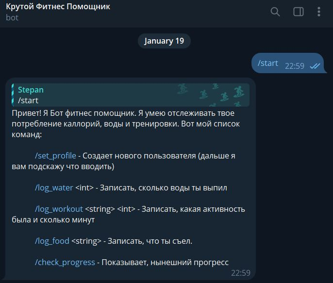
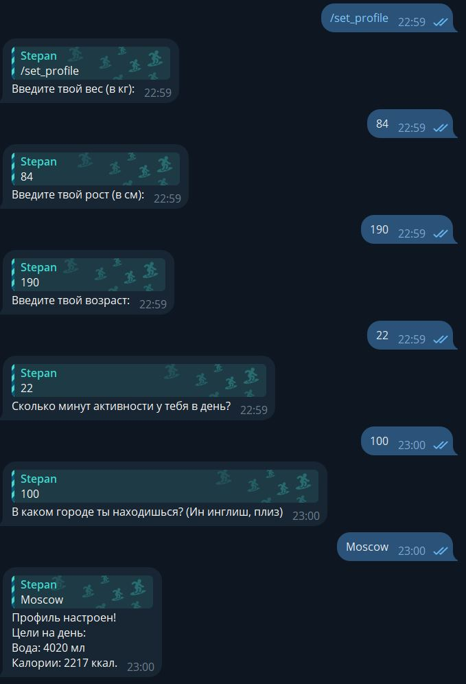
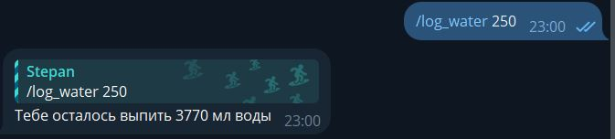
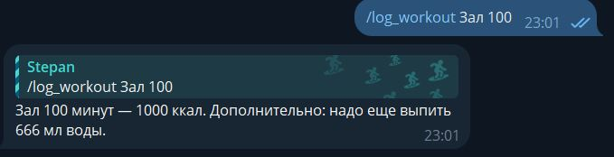
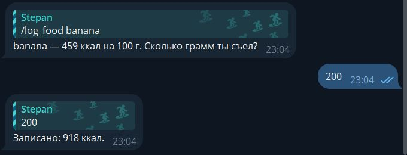
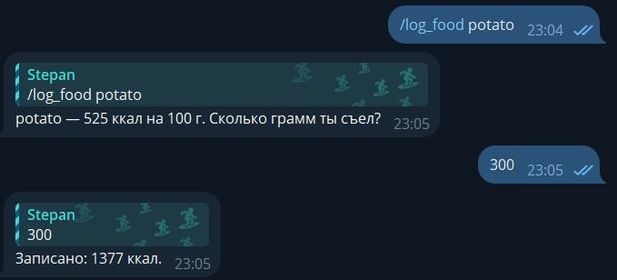
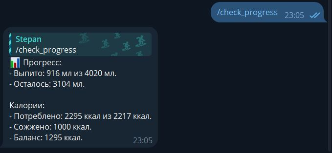
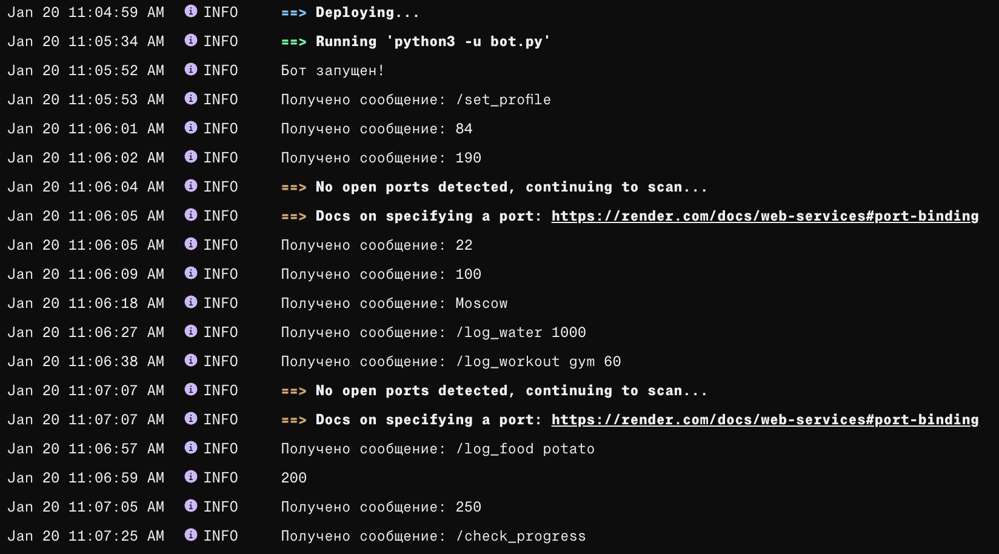

# AppliedPython_HW2

## Author: Кульжик Степан Михайлович

## Поддерживаемые команды

* `/start` - стартовая команда, после бот Вас поприветствует и расскажет о своем функционале
* `/set_profile` - команда для настройки профиля. Заполняются поля роста, веса, возраста и города, в котором Вы находитесь
* `/log_water <int>` - записывает объем (в мл) потребленной жидкости
* `/log_workout <string> <int>` - записывает название тренировки и ее длительность, обновляя, сколько осталось выпить воды, сколько калорий сожжено и тд.
* `/log_food <string>` - кидает запрос к OpenFoodAPI, откуда получает калорийность потребленной еды на 100г. Затем просит ввести массу (в гр) и записывает калорийность приема пищи
* `/check_progress` - показывает текущий прогресс по воде и калориям (сколько сожжено, сколько съедено)

## Примеры работы бота (+ пруфы деплоя)

### 1. Пример работы команды `/start`

### 2. Пример работы команды `/set_profile`

### 3. Пример работы команды `/log_water`

### 4. Пример работы команды `/log_workout`

### 5. Пример работы команды `/log_food`

### 6. Пример работы команды `/check_progress`

### 7. Демонстрация деплоя + логирование команд
